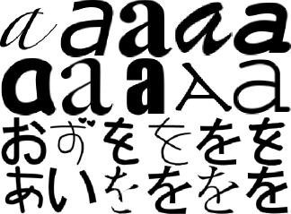

# not_notMNIST Dataset generator

This is a dataset generator given a list of fonts and characters. 
You can use it to generate any number of characters with any number of features.

One of the advantages for this tool is that you can generate datasets for Unicode characters. I personally don't have a license for a lot of fonts (and I don't know the alphabets), but if you donate it -- I will place it in this repository with your name on it :smile:



### Prerequisites

- ImageMagick
- Python 2.7+
  - numpy
  - scipy
  - pickle

## How to use the data

The data is stored in a `pickle` file. The data is stored in a single `dict` with keys 'labels' and 'images'

*Note that 'labels' are actual characters, and not just digits*

To use it in Python:

```python
# -*- coding: utf-8 -*-

import pickle
import numpy as np
import matplotlib.pyplot as plt

with open('Demo/Japanese/100x100/100x100.pickle', 'rb') as f:
  data = pickle.load(f)

labels = data['labels']
images = data['images']

num_points = len(labels)

f, ax = plt.subplots(2,2)
for i in range(2):
  for j in range(2):
    idx = np.random.randint(num_points)
    ax[i,j].imshow(images[idx], cmap='Greys_r')
plt.show()
```

## How to generate the data

Here is the list of arguments (in alphabetical order):

```
-a <string>, --alphabet <string>
  What alphabet to generate. Every character needs to be unique
  Defaults to [a-zA-Z0-9] characters
  Is overridden by --af or --alphabetfile
-af <file name>, --alphabetfile <file name>
  Open the alphabet from <file name>
  Is overridden by -a or --alphabet

-d <dir name>, --directory <dir name>
  Where to save the generated images
  Defaults to a new directory with the current dimensions as a name

-e <font name>, --exclude <font name>
  Exclude a font. Can be stacked
-ef <file name>, --excludefile <file name>
  Exclude all fonts from the file

-f <font name>, --font <font name>
  Font names to generate images for (could be location of a font)
-ff <file name>, --fontfile <file name>
  File with font names to load in a list
-fd <font dir>, --fontdir <font dir>
  Directory with the fonts you want to use. The supported extensions
  are 'ttf,ttc,otf'. You can modify it below in the code

-h, --help
  Print this help and exit

-w <number>, --width <number>
  Image width (and height). A square image is generated.
```

The simplest way to use it

```bash
$> not_notMNIST
```

That will use all the fonts that are installed on your machine, the image size would be 28x28, and the output filder would be `./28x28/`. The default alphabet is alphanumeric `[a-zA-Z0-9]`.

## Demo

### Japanese

This is a small dataset, as I don't have a lot of fonts. I just wanted to show how the tool would work with Unicode.

The data was generated using:

```
$> ./not_notMNIST -w 28 -d Demo/Japanese/28x28 -af Demo/Japanese/japanese.alphabet -ff Demo/Japanese/japanese.fonts
$> ./not_notMNIST -w 100 -d Demo/Japanese/100x100 -af Demo/Japanese/japanese.alphabet -ff Demo/Japanese/japanese.fonts
```

- `-w` was used to specify the size of the images to generate.
- `-d` specifies the directory to place tesults to
- `-af` specifies that there is an alphabet file that should be used
- `-ff` shows where is the font file -- a file where we list all the fonts

## Numeric

This one is more of a 'MNIST'-style with only numeric values generated on all of the fonts that you have. Granted it is not handwritten, but I guess you can still use it :)

```
$> ./not_notMNIST -w 28 -d Demo/Numeric/28x28 -af Demo/Numeric/numeric.alphabet -ef Demo/Numeric/numeric.exclude.txt
```

In here we also used `-ef` to specify the font exclusion list. This list specifies which fonts are not supposed to be used.

# TODO

- Fix the Unicode loading
